# ВКонтакте. Frontend-разработка. Тестовое задание 2023

## Задание

Создать форму бронирования переговорной

### Форма должна содержать следующие элементы:

-   [x] **Выпадающий список с выбором башни (А или Б)**\
         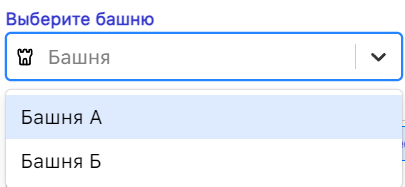

---

-   [x] **Выпадающий список с выбором этажа (с 3 по 27)**
        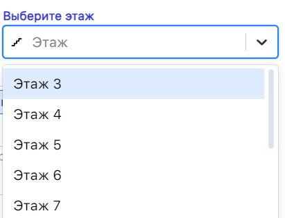

---

-   [x] **Выпадающий список с выбором переговорки. На каждом этаже 10 переговорок**
        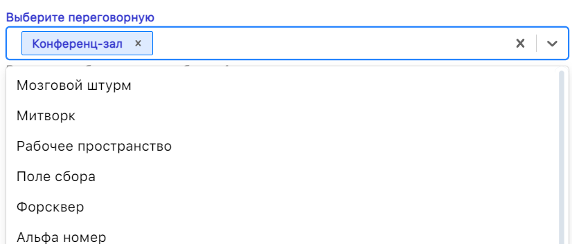

---

-   [x] **Выбор даты**
        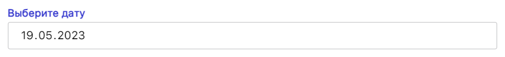

---

-   [x] **Выбор интервала времени**\

        Выбор времени окончания возможен, только после выбора времени начала
        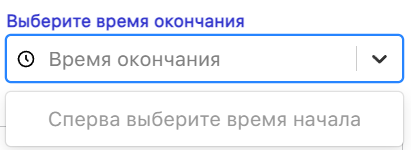\

        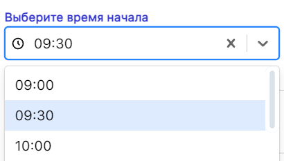\

        Время начала и конца зависят друг от друга и синхронизирются. Поэтому выбрать время начала больше, чем время окончания невозможно
        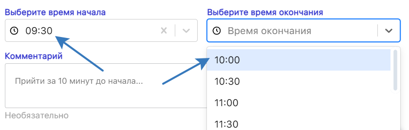\

        При выборе времени бронирования рассчитывается продолжительность брони
        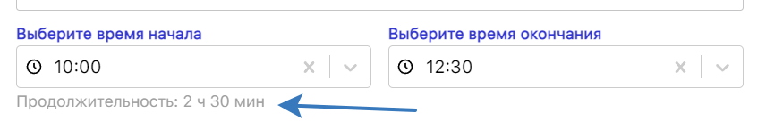

---

-   [x] **Поле ввода комментария (textarea) и кнопки "Очистить" и "Отправить"**
        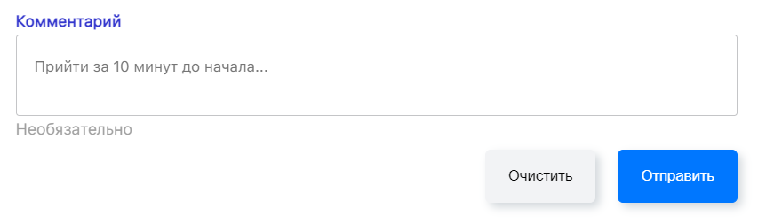

---

-   [x] **Кнопка "Отправить" (по нажатию - выводит в консоль данные формы в виде json) и уведомляет пользователя**
        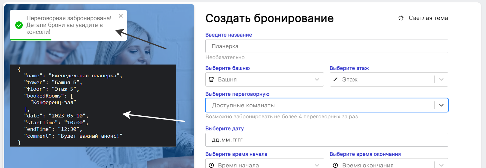

---

-   [x] **Адаптивен под мобильные и планшетные устройства**
        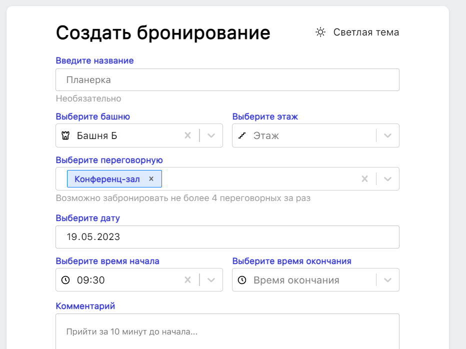
        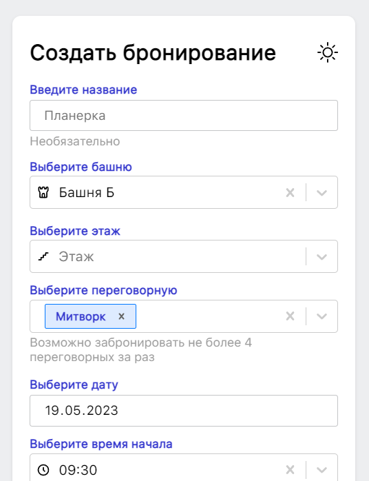

---

-   [x] **Есть светлая и темная темы**
        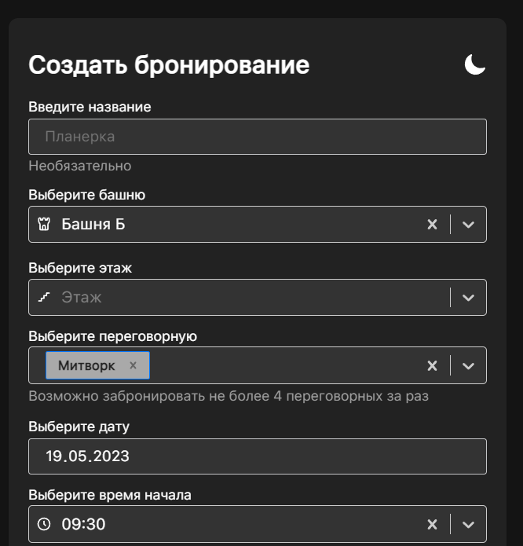
        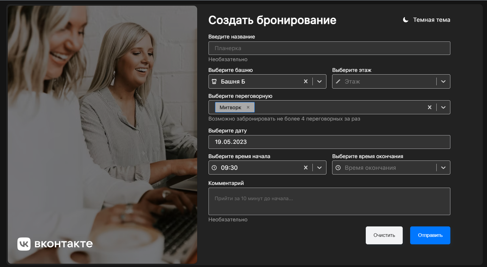
